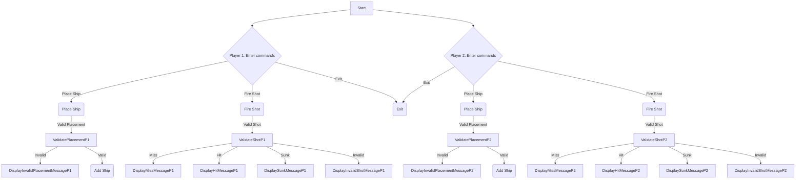

```mermaid
flowchart TD;

Start[Start] --> EnterCommandsP1{Player 1: Enter commands}
EnterCommandsP1 -->|Place Ship| PlaceShipP1(Place Ship)
EnterCommandsP1 -->|Fire Shot| FireShotP1(Fire Shot)
EnterCommandsP1 -->|Exit| ExitGame(Exit)

PlaceShipP1 -->|Valid Placement| ValidatePlacementP1
ValidatePlacementP1 -->|Invalid| DisplayInvalidPlacementMessageP1
ValidatePlacementP1 -->|Valid| AddShipP1(Add Ship)

FireShotP1 -->|Valid Shot| ValidateShotP1
ValidateShotP1 -->|Miss| DisplayMissMessageP1
ValidateShotP1 -->|Hit| DisplayHitMessageP1
ValidateShotP1 -->|Sunk| DisplaySunkMessageP1
ValidateShotP1 -->|Invalid| DisplayInvalidShotMessageP1

Start --> EnterCommandsP2{Player 2: Enter commands}
EnterCommandsP2 -->|Place Ship| PlaceShipP2(Place Ship)
EnterCommandsP2 -->|Fire Shot| FireShotP2(Fire Shot)
EnterCommandsP2 -->|Exit| ExitGame(Exit)

PlaceShipP2 -->|Valid Placement| ValidatePlacementP2
ValidatePlacementP2 -->|Invalid| DisplayInvalidPlacementMessageP2
ValidatePlacementP2 -->|Valid| AddShipP2(Add Ship)

FireShotP2 -->|Valid Shot| ValidateShotP2
ValidateShotP2 -->|Miss| DisplayMissMessageP2
ValidateShotP2 -->|Hit| DisplayHitMessageP2
ValidateShotP2 -->|Sunk| DisplaySunkMessageP2
ValidateShotP2 -->|Invalid| DisplayInvalidShotMessageP2

```
