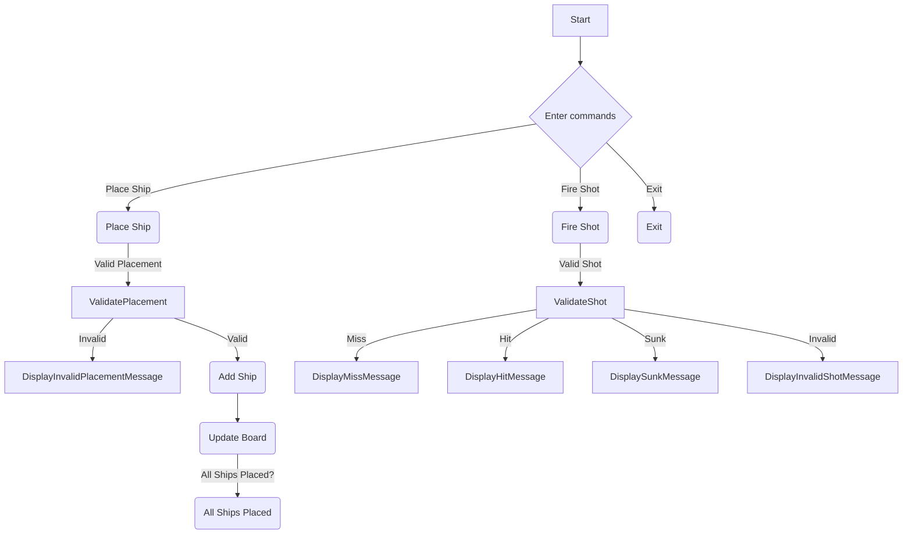

1. Start: The game begins at the "Start" node.  

2. Enter Commands: The player is prompted to enter commands. They have three options: 

Place Ship: If the player selects "Place Ship," they move to the "PlaceShip" step. 
Fire Shot: If the player selects "Fire Shot," they move to the "FireShot" step. 
Exit: If the player selects "Exit," the game ends at the "ExitGame" step.  

3. Place Ship: If the player chooses to place a ship, they move to the "PlaceShip" step. Here, the placement of the ship is validated. 

Valid Placement: If the placement is valid, the game moves to the "ValidatePlacement" step. 
Invalid Placement: If the placement is invalid, the game displays an "Invalid Placement" message and returns to the "PlaceShip" step.  4. Validate Placement: At this step, the placement of the ship is validated. 

Invalid: If the placement is invalid, the game displays an "Invalid Placement" message and returns to the "PlaceShip" step. 
Valid: If the placement is valid, the ship is added to the game board, and the game progresses.  

5. Fire Shot: If the player chooses to fire a shot, they move to the "FireShot" step. Here, the shot is validated.

Valid Shot: If the shot is valid, the game moves to the "ValidateShot" step. 
Invalid Shot: If the shot is invalid, the game displays an "Invalid Shot" message and returns to the "FireShot" step.  

6. Validate Shot: At this step, the shot is validated. 

Miss: If the shot is a miss, the game displays a "Miss" message and returns to the "FireShot" step. 
Hit: If the shot is a hit, the game displays a "Hit" message and returns to the "FireShot" step. 
Sunk: If the shot results in sinking a ship, the game displays a "Sunk" message and returns to the "FireShot" step. 
