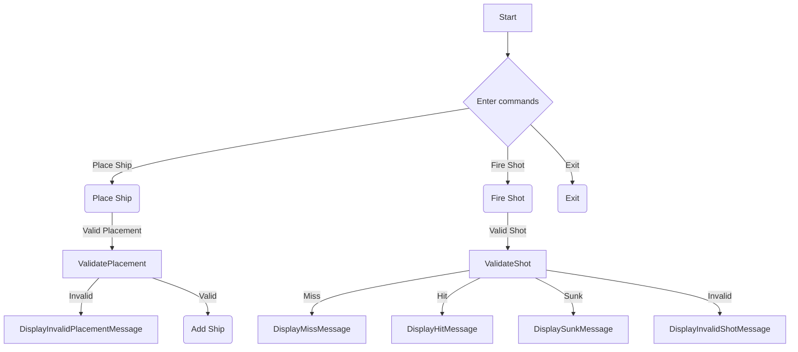

```mermaid
flowchart TD;

Start[Start] --> EnterCommands{Enter commands}

EnterCommands -->|Place Ship| PlaceShip(Place Ship)
EnterCommands -->|Fire Shot| FireShot(Fire Shot)
EnterCommands -->|Exit| ExitGame(Exit)

PlaceShip -->|Valid Placement| ValidatePlacement
ValidatePlacement -->|Invalid| DisplayInvalidPlacementMessage
ValidatePlacement -->|Valid| AddShip(Add Ship)

FireShot -->|Valid Shot| ValidateShot
ValidateShot -->|Miss| DisplayMissMessage
ValidateShot -->|Hit| DisplayHitMessage
ValidateShot -->|Sunk| DisplaySunkMessage
ValidateShot -->|Invalid| DisplayInvalidShotMessage

```
